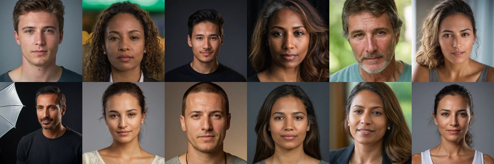

# Profile Photo Generator

[](https://github.com/ekstremedia/profile-photo-generator/actions/workflows/ci.yml)
[](LICENSE)
[](pyproject.toml)

Generate photorealistic synthetic profile photos on your own machine, and serve
them over a small HTTP API. Every face is drawn from a seeded attribute
vocabulary (sex, age, ancestry, skin tone, profession, hair, glasses, clothing,
lighting, lens), rendered locally with Stable Diffusion XL, written at several
sizes with provenance metadata, and cached by content hash. It exists because
seeding a web app with believable user avatars should not mean scraping real
people's photographs or paying per image.

<!-- contact sheet: docs/images/contact-sheet.jpg -->


**What this is**

- A local avatar generator with a stable HTTP API and a CLI.
- Deterministic: `by-seed/<any string>` always returns the same face.
- Steerable: pin any attribute you like, randomise the rest.
- Self-contained: SQLite, files on disk, one process, no external services.

**What this is not**

- Not a face swapper, and not a way to edit or restyle a photo you supply.
- Not a likeness generator. Requests that reach for a real, identifiable
  person are refused (see [SECURITY.md](SECURITY.md)).
- Not a moderation system. The input filter is narrow and text-based.

## About Ollama

Ollama does not make the pixels here. Ollama's image generation shipped in
January 2026 but is macOS + MLX only; Windows and Linux are still "coming
soon", so on Linux Ollama cannot render an image at all.

Ollama has a different and entirely optional job in this project: a small local
LLM writes the *text prompt* and a fictional persona from the sampled
attributes. With no Ollama installed, a template composer produces complete
prompts and everything works — `PPG_COMPOSER=auto` uses Ollama when it is
reachable and falls back silently when it is not. `PPG_OLLAMA_MODEL=auto` picks
whichever model you already have, preferring a small one, so you never need to
pull a model just for this project.

The pixels come from SDXL through `diffusers`, using
`SG161222/RealVisXL_V5.0` plus the separate `madebyollin/sdxl-vae-fp16-fix`
VAE. There is also an `openai_images` backend that posts to any
OpenAI-compatible `/v1/images/generations` endpoint — which is exactly the path
Ollama exposes, so switching to Ollama once Linux support lands is two
environment variables.

## Quickstart

### Docker

```bash
git clone https://github.com/ekstremedia/profile-photo-generator
cd profile-photo-generator
./scripts/setup-host.sh          # disk, nvidia-container-toolkit, host Ollama; asks before each step
cp .env.example .env
docker compose up -d
docker compose run --rm api python scripts/download-models.py   # ~7.3 GB, once
```

Then open <http://localhost:8000/docs> for the API, or <http://localhost:8000/>
for the gallery. The service is called `api`; `data/` is bind-mounted to
`/data` in the container, so weights, images and the database stay on the host.

Three compose profiles cover the other cases: `--profile cpu` for a machine
with no NVIDIA GPU, `--profile ollama` to run Ollama in a container as well,
and `--profile dev` for live reload against the working tree.

### Without Docker

```bash
python -m venv .venv && source .venv/bin/activate
pip install -e ".[gpu]"
python scripts/download-models.py   # ~7.3 GB: checkpoint + fp16-safe VAE
ppg doctor                          # verifies GPU, disk, weights, Ollama
ppg serve
```

`ppg doctor` is the first thing to run when anything looks wrong; it checks
every external dependency and names the unhappy one.

### The CLI

```bash
ppg doctor                                  # check GPU, disk, weights, Ollama
ppg warmup                                  # load the model, time one image
ppg generate --sex female --age 34 --profession "marine biologist"
ppg generate --seed someone@example.com     # deterministic
ppg batch -n 50 --diversity even            # + a contact-sheet montage
ppg options profession                      # what this instance accepts
ppg clear                                   # delete every generated avatar
ppg serve                                   # run the HTTP server
```

Commands run in-process by default. Pass `--url http://host:8000` (or set
`PPG_URL`) to drive a running server instead, container or remote.

### Try it without downloading a model

```bash
PPG_BACKEND=fake ppg serve
```

The `fake` backend needs no GPU and no weights. It renders a deterministic
placeholder card rather than a face, which is enough to exercise the API, the
sampler, the cache, the gallery and your client code. It is also what the test
suite runs against.

## A taste of the API

Generate one random face (blocks until it is done, then returns metadata):

```bash
curl -s -X POST http://localhost:8000/v1/avatars \
  -H 'content-type: application/json' -d '{}' | jq
```

```json
{
  "id": "04f550cfe28d3ac28b2318d268de96e7",
  "seed": 6152238899271447234,
  "attributes": { "sex": "female", "age": 41, "ethnicity": "east_asian", "profession": "midwife" },
  "persona": { "name": "Mei Tanaka", "age": 41, "occupation": "midwife", "city": "Sapporo" },
  "composer": "llm",
  "sizes": [1024, 512, 256, 128],
  "urls": { "default": "/v1/avatars/04f550cfe28d3ac28b2318d268de96e7/image" },
  "cached": false,
  "duration_ms": 8214
}
```

Steer it:

```bash
curl -s -X POST http://localhost:8000/v1/avatars \
  -H 'content-type: application/json' \
  -d '{"sex":"male","age":63,"profession":"ferry_captain","glasses":"thin_metal"}' | jq .persona
```

Stable avatar for a user, straight into an `` tag:

```bash
curl -o avatar.webp \
  "http://localhost:8000/v1/avatars/by-seed/$(printf 'ada@example.com' | md5sum | cut -d' ' -f1)?size=256"
```

## The killer feature

`GET /v1/avatars/by-seed/{key}` hashes any string to a seed with blake2b, so
the same key always produces the same face. Every user gets a stable avatar
with no database column, no upload flow and no placeholder service.

The first request for a key renders the image and blocks; every later request
is a static file read served with `Cache-Control: immutable`.

**Do not use a bare `md5(email)` as the key.** It ends up in an image URL, in
your access logs and in the browser's history, and an unsalted email hash is
trivially reversible for any common address — it is the address, in effect.
Use an opaque per-user value instead:

```php
// A random column on the user, or a keyed hash. Never the raw email.
$key = $user->avatar_key;                                   // best
$key = hash_hmac('sha256', $user->email, config('app.key')); // also fine
```

**What "the same face" is guaranteed against.** The key maps to a seed
deterministically and permanently. The *image* is reproducible for a fixed
model, sampler settings and `PIPELINE_VERSION`; changing `PPG_MODEL_ID`,
`PPG_STEPS`, `PPG_GUIDANCE` or the vocabulary produces a different face for the
same key, which is what `PIPELINE_VERSION` exists to make explicit. Different
GPUs and torch builds can also differ in the last few bits. Treat generated
avatars as durable data: back up `data/`, and do not assume you can regenerate
a specific face years later from the key alone.

## Hardware expectations

Measured on an RTX 4070 SUPER (12 GB), Ryzen 9 7950X3D, 61 GB RAM, Debian 13,
Python 3.13, torch 2.13.0+cu130, diffusers 0.39.0.

| Hardware | VRAM | Settings | 1024×1024, 30 steps |
| --- | --- | --- | --- |
| RTX 4070 SUPER (measured) | 12 GB | defaults | ~8 s per image; 3.3 s model load |
| 16 GB and above | ≥16 GB | defaults, `PPG_COMPILE=true` optional | at least as fast; not measured here |
| 8–10 GB cards | 8–10 GB | `PPG_LOW_VRAM=true` | roughly twice as slow (CPU offload) |
| No GPU | — | `PPG_DEVICE=cpu` | minutes per image; usable only for smoke tests |

SDXL in float16 needs about 7 GB resident. A batch of 8 images took 3 m 13 s
wall clock on the 4070 SUPER, including LLM prompt composition and writing four
sizes in two formats each.

If Ollama shares the GPU, keep `PPG_OLLAMA_KEEP_ALIVE=0` — an 8B model parked
on 5.4 GB of a 12 GB card leaves too little for SDXL and generation fails. See
[TROUBLESHOOTING.md](docs/TROUBLESHOOTING.md).

## Documentation

- [docs/ARCHITECTURE.md](docs/ARCHITECTURE.md) — request flow, the two caches, why one worker
- [docs/API.md](docs/API.md) — every endpoint, headers, status codes
- [docs/MODELS.md](docs/MODELS.md) — swapping checkpoints, VRAM and licences
- [docs/PROMPTING.md](docs/PROMPTING.md) — the vocabulary, realism cues, tuning
- [docs/LARAVEL.md](docs/LARAVEL.md) — a working integration
- [docs/TROUBLESHOOTING.md](docs/TROUBLESHOOTING.md) — start with `ppg doctor`
- [CONTRIBUTING.md](CONTRIBUTING.md) — dev setup, tests without a GPU, adding vocabulary
- [SECURITY.md](SECURITY.md) — reporting, and the standing operational warnings
- [NOTICE.md](NOTICE.md) — third-party licences

Live OpenAPI documentation is at `/docs` on a running instance.

## Contributing

Adding or rebalancing an entry in
[`src/ppg/attributes/vocab.yaml`](src/ppg/attributes/vocab.yaml) is the best
first contribution — it changes what kind of people get generated and needs no
Python. See [CONTRIBUTING.md](CONTRIBUTING.md).

## Licence

The code is MIT ([LICENSE](LICENSE)). The default weights are not: RealVisXL
V5.0 is distributed under the CreativeML Open RAIL++-M licence, which adds
use-based restrictions that MIT does not have. If that matters for your use,
[NOTICE.md](NOTICE.md) lists permissively licensed alternatives.
