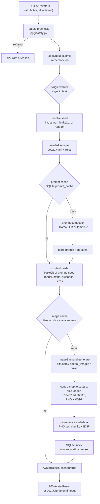

# Architecture

One request becomes one avatar through a fixed sequence. Nothing in that
sequence is clever; the interesting parts are where things are cached and where
work is serialised.

## Request flow



The HTTP layer does two things before the queue: it runs the input rules so a
refused request fails immediately with 422 rather than surfacing minutes later
as a failed job, and it submits the work. Everything from seed resolution
onwards runs on the worker.

## The two caches

They cache different things for different reasons, which is why they are
separate.

**The prompt cache** (`prompt_cache` table, keyed by attributes + seed + extra
text + composer mode) keeps the exact wording a seed first produced. An LLM is
not reproducible: ask the same model the same question twice and the phrasing
drifts, even with a fixed seed, if the model or its quantisation changes. Since
`by-seed/{md5(email)}` promises the same face forever, the wording that
produced that face has to be pinned. Cached prompts also mean a repeat request
never pays the Ollama round trip.

**The image cache** is the content hash. `compute_hash` covers the prompt, the
negative prompt, the seed, the model id, the backend name, the steps, the
guidance, the render dimensions, the size ladder and `PIPELINE_VERSION`. The
digest is the avatar id, the directory name and the ETag. Identical inputs
never render twice — a cache hit costs microseconds where a render costs
seconds.

Two consequences worth knowing:

- Changing a default (steps, guidance, model) produces a *different* path
  rather than silently serving a stale face.
- Bumping `PIPELINE_VERSION` in `src/ppg/__init__.py` invalidates the whole
  store at once. That is the intended way to handle a change to the realism
  cues or the sampler that should make old images stale.

Before trusting a database hit, `has_variants()` checks that every expected
file is actually on disk. If someone clears `data/outputs` without clearing the
database, the row is treated as a miss and the image is regenerated rather than
404-ing.

## Storage layout

```
data/
  ppg.db                                  SQLite index (WAL mode)
  hf-cache/                               model weights (HF_HOME)
  outputs/04/f5/04f550cfe28d3ac2.../1024.webp
                                          two levels of fan-out, then the digest
```

The fan-out keeps directory listings usable at a few hundred thousand avatars.
Files are content-addressed, so they are served with
`Cache-Control: public, max-age=31536000, immutable`.

The model renders one image at `PPG_WIDTH` × `PPG_HEIGHT` (1024² by default).
That image is centre-cropped to a square — biased upwards, because on a
portrait the face sits above centre — and then written at every size in
`PPG_SIZES`, in both PNG and WebP. Downscaling uses LANCZOS, which keeps skin
texture and eyelashes crisp where a bilinear resize turns them to mush. The PNG
is the master the OpenAI shim re-encodes from; WebP is what the API serves.

## Exactly one worker

`JobQueue` has a single consumer task, on purpose. There is one GPU and a
diffusion model saturates it: running two generations concurrently makes both
slower and risks an out-of-memory error on a card that also has to hold the
weights. The queue is a serialisation point, not a scalability bottleneck
waiting to be widened. If you need more throughput, run more instances behind a
load balancer with a shared `PPG_DATA_DIR`, or use a bigger card and raise the
step count instead.

The worker never dies from a bad job: a `SafetyError` is recorded on the job as
a client error and the loop continues, and any other exception is logged and
attached to the job.

## Jobs are ephemeral, avatars are durable

Jobs live in a dict in memory and are pruned once there are more than 500 of
them. They are progress trackers: status, position in the queue, an ETA from a
rolling mean of the last 20 generations, and the resulting avatar ids. Losing
them on restart loses a progress bar, not any work — the images they produced
are on disk and in SQLite. `GET /v1/jobs/{id}` says as much in its 404 message.

This is why `POST /v1/avatars` blocks by default (`PPG_DEFAULT_WAIT=60`): for a
single image, waiting a few seconds is far simpler to consume than polling, and
the job model is there for the cases where it is not (batches, slow hardware,
`wait=0`).

SQLite rather than Postgres because the project should start with one command.
The write volume is one row per generated image and writes are already
serialised behind the GPU, so there is no concurrency pressure worth a second
service. WAL mode is on so the gallery can read while the worker writes.

## The `ImageBackend` protocol

Swapping how pixels get made never touches the API, the sampler or the store.
`ppg/backends/base.py` defines a runtime-checkable `Protocol`:

```python
@dataclass(frozen=True)
class RenderSpec:
    prompt: str
    negative_prompt: str
    width: int
    height: int
    steps: int
    guidance: float
    seed: int

class ImageBackend(Protocol):
    name: str
    @property
    def model_id(self) -> str: ...
    @property
    def loaded(self) -> bool: ...
    async def load(self) -> None: ...
    async def generate(self, spec: RenderSpec) -> Image.Image: ...
    async def unload(self) -> None: ...
```

`RenderSpec` in, a PIL image out. Three implementations ship:

| Backend | Module | Needs | Notes |
| --- | --- | --- | --- |
| `diffusers` | `backends/diffusers_sdxl.py` | GPU, 7 GB of weights | the default; SDXL in-process |
| `openai_images` | `backends/openai_images.py` | an HTTP endpoint | any OpenAI-compatible `/v1/images/generations` |
| `fake` | `backends/fake.py` | nothing | deterministic placeholder cards for CI and demos |

`build_backend()` imports the chosen module and only that one — importing
`diffusers_sdxl` pulls in torch, which is several seconds of import time and is
not installed at all in the test image.

`name` and `model_id` are recorded in the content hash and in every image's
metadata, so images made by different backends never collide in the cache.

## Prompt composition

`AutoComposer` (the default) tries `LLMComposer` and falls back to
`TemplateComposer` when Ollama is unreachable, returns nothing usable, or
fails schema validation twice. The fallback is not a degraded mode with missing
features: the template composer produces complete prompts and a persona from
`prompt/names.yaml`; the LLM version is more varied and adds the small
lived-in details a lookup table cannot invent.

In both cases the framing clause and the realism cue block are appended by us,
not by the model. Those are what make the output read as a photograph, so they
are not left to chance. See [PROMPTING.md](PROMPTING.md).

At startup the composer probes Ollama once and resolves
`PPG_OLLAMA_MODEL=auto` to a concrete tag, so a machine without Ollama pays one
five-second timeout at boot rather than on every generation.

## Model loading

`create_app()` starts the backend load as a background task. Startup does not
block on it, but `/readyz` reports `model_loaded: false` until it finishes, so
an orchestrator can gate traffic. `/healthz` stays 200 for the whole process
lifetime and is only a liveness signal.

On the measured machine a warm cache loads RealVisXL in 3.3 s.

## Module map

```
src/ppg/
  __init__.py            version, PIPELINE_VERSION, PYTORCH_CUDA_ALLOC_CONF
  config.py              pydantic-settings, every PPG_* variable
  schemas.py             the public request/response contract
  safety.py              input rules; raises SafetyError → 422
  service.py             the pipeline above, end to end
  cli.py                 doctor, warmup, generate, batch, options, serve, version
  api/                   FastAPI app, routers, auth dependency
  attributes/            vocab.yaml and the seeded sampler
  prompt/                template + LLM composers, Ollama client, names.yaml
  backends/              ImageBackend implementations
  pipeline/worker.py     the single-consumer job queue
  store/                 content-addressed files, imaging, SQLite
```
